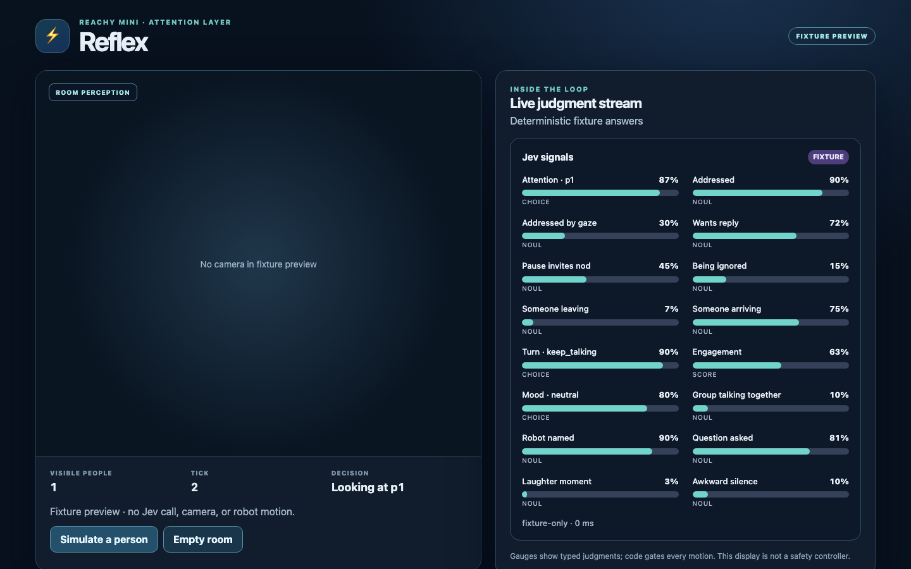

# Reachy Reflex

A social-attention layer for Reachy Mini. Sixteen typed Jev judgments describe the room; deterministic policy chooses gaze, nods, posture, and local control events. Jev never sends motor commands directly.



_Browser fixture preview with one simulated person and deterministic answers. No camera, Jev call, or robot motion was used to make this image._

This is a development preview, not a hardware-tested release. The browser app now has the Reachy Mini host shell, WebRTC camera attachment, local face-box detection, opt-in robot-stream sound-energy hints, opt-in local robot-stream ASR, an opt-in browser-device transcription path, a 16-signal panel, an authenticated local Jev relay, an opt-in local control-event stream, an opt-in bounded motion adapter, and an opt-in text-free session trace. Face detection, robot audio, browser microphone access inside the host, and motion have **not** been validated on a real robot. Robust VAD, direction-of-arrival, speaker attribution, a Conversation App consumer, hosted relay deployment, and calibration are still missing. No attention accuracy, end-to-end latency, cost, or human-preference result is claimed.

## Run and verify

Node.js 20.19+ is required. `reachy-jev` is installed from a pinned commit of its [public source repository](https://github.com/AbdelStark/reachy-jev); no sibling checkout or registry release is required. npm runs that package's `prepare` build during installation. Review the pinned source when updating the dependency.

```sh
npm ci
npm run check
npm test
npm run replay:scenes
npm run build
npx playwright install chromium
npm run test:e2e
```

Run `npm run dev` and open `http://127.0.0.1:5173/?preview=1` for a robot-free fixture preview. Its simulated person and answers exercise the panel and policy but are not Jev or hardware results. **Full-screen panel** expands the 16 gauges for a display or recording; Escape or the button returns to the page. It changes presentation only: it does not enable recording, a relay, or motion, and an already-running judgment loop continues under its existing settings. Browser/host iframe policy may deny full screen, in which case the panel stays in page. The browser suite covers the 16 gauges, full-screen entry/exit and denial, room changes, opt-in transcript path with a fake recognizer, a synthetic connected-host text-only judgment with no motion, local trace download/discard, narrow viewport, and locally served MediaPipe WebAssembly files. Unit tests cover tracking, stale observations, relay boundaries, motion gating, transcript bounds, and trace redaction/retention.

## Model-backed local use

Set `TYPESAFE_API_KEY` and a random `REFLEX_RELAY_TOKEN` of at least 32 characters in your local shell, then run `npm run relay` separately. It binds to `127.0.0.1:8048`, allows only `REFLEX_ALLOWED_ORIGIN` (default `http://127.0.0.1:5173`), bounds body size, concurrency, and requests per minute, and never logs state or credentials. Enter the URL and session token in the browser app; the token is held only in that tab. Do not put the TypeSafe API key in Vite variables, browser JavaScript, or a static Space secret.

The judgment panel always shows a cost/usage line. Its token counts include only fresh relay responses that reported complete, valid input and output usage; cached policy ticks do not add another receipt. A request that errors, times out, or returns incomplete usage is counted separately as unresolved, because it might still have reached a billable model. Late responses are counted even when a context reset prevents their answers from reaching the panel. These tab-only numbers are not persisted and are not an invoice. Dollar cost is deliberately unavailable until a verified model-specific rate and authoritative billing reconciliation exist; reconnecting, closing the tab, or using another client can leave spend outside this display. Fixture preview makes no model calls.

### Local control events (opt-in)

Set a separate random `REFLEX_EVENT_SUBSCRIBER_TOKEN` of at least 32 characters **before starting the relay** to enable its read-only WebSocket endpoint. It must differ from `REFLEX_RELAY_TOKEN`; do not share the billable-model publisher token with a subscriber. A local backend consumer connects to `ws://127.0.0.1:8048/v1/events` with `Authorization: Bearer <subscriber token>` in the upgrade request. The relay accepts at most eight subscribers and closes a subscriber that sends data. It does not persist or replay events. Keep both tokens private and the relay on numeric loopback; this is not a public WebSocket service.

In the connected app, enable face tracking, connect the relay, and separately check **Publish fresh, text-free control hints**. A fresh, stable camera judgment may then publish a typed `attention`, `user_addressed`, `yield`, or `interrupt` hint via an authenticated POST to that same loopback relay. The WebSocket envelope is `{"schema":"reflex.event@1","seq":1,"t_ms":...,"event":{"type":"attention","person":"p1"}}`. Only session labels `p1`–`p9` and bounded probabilities are allowed; no transcript, frame, or raw audio is sent. A slow answer, old cached copy, changed face bearing/ID, lost video, or consent/context reset does not authorize a new event. Turning the switch off stops future publishes but cannot retract a request already sent. An HTTP accept and subscriber count are **not** a consumer-action or robot receipt.

The current host does not ingest the Conversation App's `currently_speaking` state, and no Conversation App consumer is attached. Do not use these hints to stop TTS or move hardware without an independently reviewed consumer, expiry and idempotency handling, and live integration tests. The bridge has Node boundary tests and a synthetic-browser test that crosses the actual loopback relay and authenticated WebSocket subscriber; neither is a robot or Conversation App result.

### Optional local speaking-state feed

Set a third, distinct `REFLEX_SPEAKING_WRITER_TOKEN` of at least 32 characters before starting the loopback relay. A separately owned local app may POST a text-free `{"schema":"reflex.speaking@1","session":"random_session_id","seq":1,"speaking":true}` to `http://127.0.0.1:8048/v1/speaking` with `Authorization: Bearer <writer token>` and no browser `Origin` header. Use a random session ID of 8–64 letters/digits/underscores/hyphens, monotonically increase `seq`, and refresh the assertion at least once per second while its state remains relevant. The relay rejects replayed/out-of-order updates, a different session while the previous one is fresh, browser-origin writes, unexpected fields, and oversized bodies. It expires the state after 1.5 seconds. Never send audio, transcript text, or a TypeSafe key to this endpoint.

In a connected Reflex tab, separately check **Use a separate local app's speaking-state assertion**. The browser reads only the short-lived state with its existing relay token. A new, changed, expired, or unavailable assertion resets judgment evidence and may trigger a fresh billable Jev call; `yield`/`interrupt` hints require a fresh `speaking: true` assertion plus the existing camera/model event gate. The app holds a proposed nod when speaking state is unknown. `reflex.tick@3` traces distinguish an asserted quiet state from missing speaking evidence; the offline replay reader also accepts older `@2` traces. This feed is only an assertion from another process—not an SDK playback-complete receipt, physical-silence proof, or TTS control channel. [Reachy Conscience](https://github.com/AbdelStark/reachy-conscience) now has an opt-in owned writer: successful audio enqueue asserts possible speech, and its operator asserts quiet only before a subsequent command after listening for completion. Neither project has exercised this path with a robot or live turn-taking; the Reflex integration test still uses a synthetic writer and fake model.

The browser host follows Pollen Robotics' pinned [Reachy Mini JS app guide](https://github.com/pollen-robotics/reachy_mini/blob/main/ts/APP_CREATION_GUIDE.md) using SDK 1.8.0. Camera frames remain in the browser. MediaPipe WebAssembly ships with the built app. At build time, the face model is fetched from Google's versioned model URL and checked against SHA-256 `b4578f35940bf5a1a655214a1cce5cab13eba73c1297cd78e1a04c2380b0152f`; the browser then loads it from the app's origin. Local dev serves the same verified asset. Face tracking remains off until the user enables it. MediaPipe 1.0.1 can send usage/performance metrics to Google when initialized; [Google's privacy notice](https://github.com/google-ai-edge/mediapipe#privacy-notice) says it does not send frames. This is not a fully offline path. Only bucketed room state, plus separately consented final transcript fields, reaches Jev through the relay.

Robot sound-energy hints use the pinned host SDK's `media.robotStream` audio track only after the connected user enables the separate toggle. A Web Audio analyser is never connected to speakers; a 1,024-sample window is reduced locally to RMS level and a coarse threshold flag, then the shared room-state builder converts the level into a word bucket before relay transmission. The app does not retain or send raw robot audio. The threshold flag is **not** reliable VAD: it can fire on noise or robot speech, and gives no direction or speaker identity. Turning it off closes the analyser without stopping the host-owned track. If the robot stream has no live audio track, no sound state is sent. This path has unit tests but no on-robot validation.

Browser transcription requires two explicit actions: check the microphone/data-sharing disclosure, then press **Start transcription**. The host permits iframe microphone capture but does not start it automatically. This path uses this device's microphone, **not** Reachy's microphone. The browser's `SpeechRecognition` may process audio on a vendor server and is unavailable in some browsers. The app keeps at most two final utterances of 200 characters each for 30 seconds in tab memory, labels their speaker `unknown`, and sends that text with room state to the configured relay only while sharing is enabled. Interim results are ignored; no audio is recorded by the app. Unchecking consent or pressing Stop clears local text and aborts recognition, but cannot retract a request already in flight. The fixture browser test uses a fake recognizer, not a real microphone or vendor service.

Robot-stream transcription is a separate local-only option. Install `requirements-asr.txt` in a separate Python environment, supply an existing self-contained converted faster-whisper model directory, set a fresh `REFLEX_ASR_TOKEN` of at least 32 printable ASCII characters, and run `python3 -m server.local_asr --model-path /path/to/local/model`. The optional model is **not bundled or downloaded** by Reflex; CPU/int8 inference is forced with `local_files_only=True`. The ASR server listens on `127.0.0.1:8051` and accepts only the exact browser origin (`http://127.0.0.1:5173` by default, configurable with `--origin`). Set that URL and token in the app, check the robot-audio disclosure after obtaining consent from people nearby, then press **Start robot transcription**. The host's `media.robotStream` audio is segmented in-tab by an energy threshold and sent as bounded 16 kHz PCM to that local process. Only final text enters the same 30-second, two-utterance buffer, marked `unknown`, and can reach Jev through the separately configured relay. Browser-device and robot-stream transcription cannot run simultaneously. Turning either off clears its recent text and aborts pending ASR, but an already-started relay call cannot be recalled. The energy threshold is not robust VAD: ambient noise, Reachy playback, and overlapping voices can be missegmented. It provides no DoA, echo cancellation, or speaker identification. Do not expose either loopback service to the network. The worklet/browser test uses a synthetic oscillator and fake ASR, not a robot or real model.

When face tracking is off or unavailable, a consented **final transcript** can still trigger the 16-signal Jev panel. That request contains no camera-derived person IDs; the speaker stays `unknown`, the decision reads “Audio only · motion off,” and no robot command is sent. Sound-energy hints alone do not start a text-only judgment. When the 30-second final-text window expires or consent is withdrawn, the panel returns to idle/stale and discards a late text-only response. This path may incur relay/model calls while recent text is present; it has a fake-host browser test, not an on-robot result.

Faces have session-only labels `p1`–`p9` and are tracked by box overlap, not recognized. Unmatched labels normally expire after 60 seconds. If all nine are reserved but a within-cap frame contains a new unmatched face, the tracker recycles a label from a face absent in that frame instead of hiding the newcomer for a minute. That recycle resets policy state and discards any in-flight Jev answer tied to the old label. A frame with more than nine detections is **not truncated into a partial room**: it clears prior perception, stops judgments, disarms motion, and requires a fresh scene plus explicit re-arm before movement resumes. A detector can still miss a face in a within-cap frame, and box matching can confuse overlapping or re-entering people, so these labels are not identity evidence. The default 60° camera field of view is an uncalibrated estimate; resulting bearing and distance are approximate.

Movement remains off until a connected user enables both face tracking and experimental robot motion. Even then, motion is held if the source answer is over 750 ms old, either camera frame is over 500 ms old, face IDs or bearings change materially, or tracking/motion is toggled during the call. Cached answers keep their original source age instead of being treated as fresh. The panel may still show a judgment when motion is held. These are application-level freshness limits, not calibrated safety thresholds; SDK and firmware limits and physical stop controls remain independent requirements. Fake-host browser tests cover slow/cached answers, an ID-recycle race, and over-capacity recovery, not robot timing. See [SECURITY.md](SECURITY.md).

Changing tracking, sound, transcript sharing, motion authorization, or tab visibility also resets policy hysteresis. A late reply from the previous context is discarded before it can update policy state or the panel, and the client cache is cleared so a stable scene can obtain a new judgment. These are software race guards; they do not retract an already-sent relay request or establish robot stopping latency.

## Local judgment trace

The trace checkbox is off by default. After getting consent from people nearby, an operator can record up to 1,200 processed ticks (about five minutes at 4 Hz) in tab memory, download schema-versioned JSONL, or discard it. Enabling recording resets policy hysteresis so the first recorded row has a reproducible starting state; later context resets and relay replacement increment a `policy_epoch` in `reflex.tick@3`. Each row contains a policy clock, approximate session-only face IDs/bearings, whether recent text was present, whether robot-speaking state was known and asserted, the validated typed judgments, stale/cache metadata, policy output, and whether the motion request was accepted, held, or off. It never includes transcript text, video frames, raw audio, a name, or a wall-clock timestamp. The export is still potentially sensitive behavioral data: keep it private, inspect it before sharing, and do not mistake fixture rows for live Jev or robot evidence. There is no automatic upload, IndexedDB persistence, or model/hardware performance claim. The unit and browser tests check the software format and redaction only.

## Offline policy replay

`npm run replay:scenes` checks a committed, self-authored corpus of 43 synthetic policy ticks across gaze hysteresis, address/nod/turn-taking, stale/ignored transitions, and interrupted target evidence. Each `reflex.scene@1` JSONL row supplies a scene-local clock, session-only person bearings, compact answer overrides, and hand-authored expected gaze, nod, idle, and event outcomes. The runner resets policy between scenes, rejects malformed or out-of-order rows, and exits nonzero on a mismatch; CI runs it on Node 20 and 22. A stale judgment or a gap of at least two seconds between fresh judgments breaks the continuous “being ignored” and “no target” timers and the partial gaze-switch hysteresis. An outage or hidden-tab pause cannot complete a two-tick gaze switch or count toward an idle transition after recovery. These are policy checks, not observed robot motion.

For a downloaded `reflex.tick@3` trace, run `npm run replay:trace -- path/to/reflex-trace.jsonl`. This reconstructs each policy epoch from the recorded typed judgments and scene bearings, then compares gaze, nod, idle state, events, and abstract pose targets. It also accepts `@2` traces but those cannot distinguish an asserted quiet state from missing speaking evidence. It rejects malformed or out-of-order rows and exits nonzero on policy drift. It does **not** replay the model call, video, audio, SDK dispatch, physical robot motion, or the truth of a human interaction; the recorded motion outcome is evidence only. Older `reflex.tick@1` exports lack reset boundaries and cannot be reliably replayed by this command. A trace collected after this change may still be a selected, consented sample rather than a representative evaluation corpus.

The committed `reflex.scene@1` set remains a synthetic regression corpus, not recorded people, real Jev answers, a calibration set, or a hardware test. Neither replay command measures model accuracy or latency. Real consented scene collection and model/hardware validation remain separate work.

The Hugging Face Space frontmatter is build metadata, not evidence of a deployed Space. A hosted static Space needs a separate HTTPS relay with authentication, rate limits, and a strict origin allowlist; a viewer's browser cannot reach your loopback relay. See [CONTRIBUTING.md](CONTRIBUTING.md), [CHANGELOG.md](CHANGELOG.md), and [CITATION.cff](CITATION.cff).
